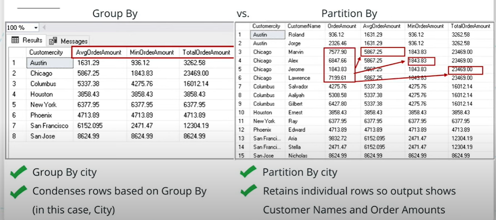
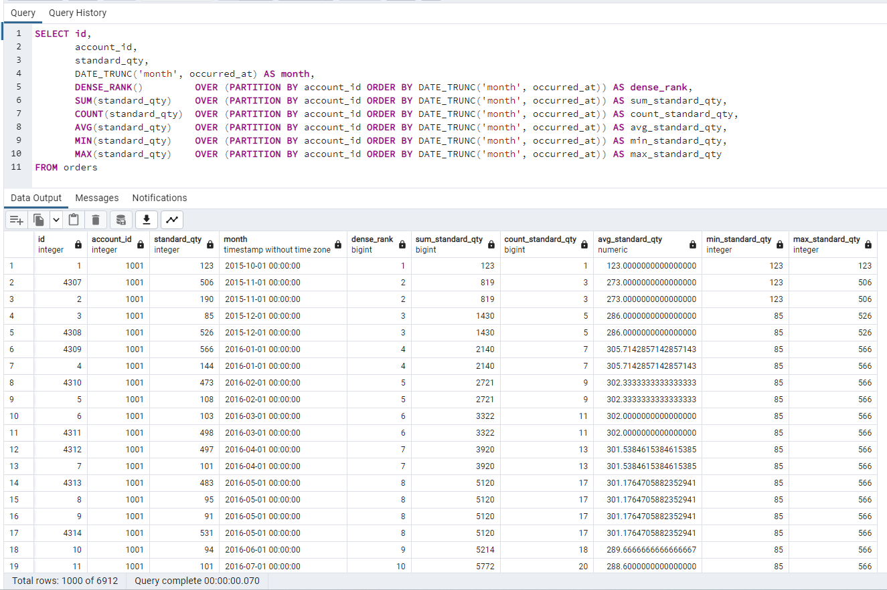

## Window Functions

### Two Use Cases for Window Functions

- When you want to measure trends or changes over rows or records in your data.
- When you want to rank a column for outreach or prioritization.

A few cases where you’d have these needs are described below:

#### Measuring change over time:
- Has the average price of airline tickets gone up this year?
  - Calculate a running average of ticker prices partitioned by the month and ordered by time
- What’s the best way to keep the running total orders of customers?
  - Calculate a running total of orders and maintain as a separate row within the table
#### The ranking used for outreach prioritization:
- Use a combination of factors to rank companies most likely to need a loan.
  - Include a rank column to be used by a BD rep to reach out to potential customers

### What is a Window Function?

A window function is a calculation across a set of rows within a table that is related to the current row. Window functions are similar to aggregate functions, but they retain the total number of rows between the input table and the output table (or result).

Window functions are permitted only in the SELECT list and the ORDER BY clause of the query.

They are forbidden elsewhere, such as in GROUP BY, HAVING and WHERE clauses. This is because they logically execute after the processing of those clauses. Also, window functions execute after regular aggregate functions. This means it is valid to include an aggregate function call in the arguments of a window function, but not vice versa.

This is from the Postgres documentation:

"A window function performs a calculation across a set of table rows that are somehow related to the current row. This is comparable to the type of calculation that can be done with an aggregate function. But unlike regular aggregate functions, use of a window function does not cause rows to become grouped into a single output row — the rows retain their separate identities. Behind the scenes, the window function is able to access more than just the current row of the query result."

More here: https://www.postgresql.org/docs/9.1/tutorial-window.html

Here is the general form of a window function:
```sql
AGGREGATE_FUNCTION (column_1) OVER
  (
    PARTITION BY column_2 
    ORDER BY column_3
  ) AS new_column_name;
```

For example:

- Calculating running totals that incorporate the current row
- Ranking records across rows, inclusive of the current one

A detailed example:

#### Problem: Compare each employee's salary with the average salary in his or her department:

```sql
SELECT 
  depname, 
  empno, 
  salary, 
  avg(salary) OVER 
    (
      PARTITION BY depname
    ) as average
FROM empsalary;
```

The resulting table:

  depname  | empno | salary |          average          
-----------|-------|--------|-----------------------
 develop   |    11 |   5200 | 5020.0000000000000000
 develop   |     7 |   4200 | 5020.0000000000000000
 develop   |     9 |   4500 | 5020.0000000000000000
 develop   |     8 |   6000 | 5020.0000000000000000
 develop   |    10 |   5200 | 5020.0000000000000000
 personnel |     5 |   3500 | 3700.0000000000000000
 personnel |     2 |   3900 | 3700.0000000000000000
 sales     |     3 |   4800 | 4866.6666666666666667
 sales     |     1 |   5000 | 4866.6666666666666667
 sales     |     4 |   4800 | 4866.6666666666666667
(10 rows)

In this example, the fourth column represents an average taken across all the table rows that have the same depname value as the current row.

Another example:

#### Problem: Rank employee's by salary in descending order within department.
```sql
SELECT 
  depname, 
  empno, 
  salary, 
  rank() OVER 
    (
      PARTITION BY depname 
      -- You can order the ranking differently than you order the result table
      ORDER BY salary DESC
    ) 
FROM empsalary;
```

The resulting table:
  depname  | empno | salary | rank 
-----------|-------|--------|------
 develop   |     8 |   6000 |    1
 develop   |    10 |   5200 |    2
 develop   |    11 |   5200 |    2
 develop   |     9 |   4500 |    4
 develop   |     7 |   4200 |    5
 personnel |     2 |   3900 |    1
 personnel |     5 |   3500 |    2
 sales     |     1 |   5000 |    1
 sales     |     4 |   4800 |    2
 sales     |     3 |   4800 |    2
(10 rows)

As shown here, the rank function produces a numerical rank within the current row's partition for each distinct ORDER BY value, in the order defined by the ORDER BY clause. rank needs no explicit parameter, because its behavior is entirely determined by the OVER clause.

The rows considered by a window function are those of the "virtual table" produced by the query's FROM clause as filtered by its WHERE, GROUP BY, and HAVING clauses if any. For example, **a row removed because it does not meet the WHERE condition is not seen by any window function.** A query can contain multiple window functions that slice up the data in different ways by means of different OVER clauses, but they all act on the same collection of rows defined by this virtual table.

We already saw that ORDER BY can be omitted if the ordering of rows is not important. It is also possible to omit PARTITION BY, in which case there is just one partition containing all the rows.

Another example illustrating the **window frame** concept:

#### Problem: Get salary and the sum of all salaries from empsalaray.

```sql
SELECT 
  salary, 
  -- Leaving out the partition means you're considering all rows
  sum(salary) OVER () 
FROM empsalary;
```

The resulting table:

 salary |  sum  
--------|-------
   5200 | 47100
   5000 | 47100
   3500 | 47100
   4800 | 47100
   3900 | 47100
   4200 | 47100
   4500 | 47100
   4800 | 47100
   6000 | 47100
   5200 | 47100
(10 rows)

#### Problem: What would happen if we added an order by clause to the above problem?

```sql
SELECT 
  salary, 
  sum(salary) OVER 
    (
      ORDER BY salary
    ) 
FROM empsalary;
```
The resulting table:

 salary |  sum  
--------|-------
   3500 |  3500
   3900 |  7400
   4200 | 11600
   4500 | 16100
   4800 | 25700
   4800 | 25700
   5000 | 30700
   5200 | 41100
   5200 | 41100
   6000 | 47100
(10 rows)

#### Can you filter or group rows after a window function is performed?

If there is a need to filter or group rows after the window calculations are performed, you can use a sub-select.

```sql
SELECT 
  depname, 
  empno, 
  salary, 
  enroll_date
FROM
  (
    SELECT 
      depname, 
      empno, 
      salary, 
      enroll_date,
      -- The window function is in the inner query
      rank() OVER 
        (
          PARTITION BY depname 
          ORDER BY salary DESC, empno
        ) AS pos
    FROM empsalary
  ) AS ss
-- The outer query filters the results of the inner query, showing only those with a pos over 3
WHERE pos < 3;
```

#### What if your query has multiple window functions with the same partition?

You can group them like this:

```sql
SELECT 
  sum(salary) OVER w, 
  avg(salary) OVER w
FROM empsalary
WINDOW w AS (
  PARTITION BY depname 
  ORDER BY salary DESC
);
```

Back to the Udacity material.

Term | Definition
-----| ----------
**Basic**
Partition by | A subclause of the OVER clause. Similar to GROUP BY.
Over | Typically precedes the partition by that signals what to “GROUP BY”.
Aggregates | Aggregate functions that are used in window functions, too (e.g., sum, count, avg).
**Ranking**
Row_number() | Ranking function where each row gets a different number.
Rank() | Ranking function where a row could get the same rank if they have the same value.
Dense_rank() | Ranking function similar to rank() but ranks are not skipped with ties.
**Advanced**
Aliases | Shorthand that can be used if there are several window functions in one query.
Percentiles | Defines what percentile a value falls into over the entire table.
Lag/Lead | Calculating differences between rows’ values.

### Problems

1. Create a running total of standard_amt_usd (in the orders table) over order time with no date truncation. Your final table should have two columns: one with the amount being added for each new row, and a second with the running total.

This is actually a little bit tricky, because there is no partition, just an order by clause.
```sql
select 
	standard_amt_usd,
    sum(standard_amt_usd) over (
      -- Notice that there's no partition clause, only an order by clause
    	order by occurred_at
     ) running_total
from orders
```

2. Create a running total of standard_amt_usd (in the orders table) over order time, but this time, date truncate occurred_at by year and partition by that same year-truncated occurred_at variable.

```sql
select
  date_trunc('year', occurred_at)
  standard_amt_usd,
  sum(standard_amt_usd) over (
    partition by date_trunc('year', occurred_at)
    order by occurred_at
  ) running_total
from orders o
```

### The Difference between GROUP BY and PARTITION BY

GROUP BY will condense the rows in the "partition" to one row of data per GROUP BY clause. PARTITION BY retains all of the rows in the data and shows the aggregation in a new column.

#### Similarities
Both groups by/aggregation queries and window functions serve the same use case. Synthesizing information over time and often grouped by a column (e.g., a region, month, customer group, etc.)

#### Differences
The difference between group by/aggregation queries and window functions is simple. The output of window functions retains all individual records whereas the group by/aggregation queries condense or collapse information.



The results table on the right-hand side in that image was created with this query:

```sql
SELECT order_id,
       order_total,
       order_price,
       SUM(order_total) OVER
           (PARTITION BY month(order_date) ORDER BY order_date) AS running_monthly_sales,
       COUNT(order_id) OVER
           (PARTITION BY month(order_date) ORDER BY order_date) AS running_monthly orders,
       AVG(order_price) OVER
           (PARTITION BY month(order_date) ORDER BY order_date) AS average_monthly_price
FROM  amazon_sales_db
WHERE order_date < '2017-01-01';
```

Here's another query, this time from Parch and Posey, that shows us 6 different aggregate functions over a partition by account_id with order by date trunc of month. To phrase this as a problem:

Show the ranking, total quantity purchased, order count, average order quantity, smallest order quantity, and largest order quantity all of standard paper by customer by month.

```sql
SELECT id,
       account_id,
       standard_qty,
       DATE_TRUNC('month', occurred_at) AS month,
       DENSE_RANK() 		    OVER (PARTITION BY account_id ORDER BY DATE_TRUNC('month', occurred_at)) AS dense_rank,
       SUM(standard_qty) 	  OVER (PARTITION BY account_id ORDER BY DATE_TRUNC('month', occurred_at)) AS sum_standard_qty,
       COUNT(standard_qty) 	OVER (PARTITION BY account_id ORDER BY DATE_TRUNC('month', occurred_at)) AS count_standard_qty,
       AVG(standard_qty) 	  OVER (PARTITION BY account_id ORDER BY DATE_TRUNC('month', occurred_at)) AS avg_standard_qty,
       MIN(standard_qty) 	  OVER (PARTITION BY account_id ORDER BY DATE_TRUNC('month', occurred_at)) AS min_standard_qty,
       MAX(standard_qty) 	  OVER (PARTITION BY account_id ORDER BY DATE_TRUNC('month', occurred_at)) AS max_standard_qty
FROM orders
```

And here's the result table shown in pgAdmin:



So, for example, looking at row 28, we can see that account 1001 has 
- 15 months to consider
- the running total got up to 7,896 units of standard paper
- there were 28 orders placed in those 15 months
- the average order size was 282 units per order
- the smallest order was 85 units
- the largest order was 566 units.

### The Three Types of Ranking Functions

- Row_number(): Ranking is distinct amongst records even with ties in what the table is ranked against.
- Rank(): Ranking is the same amongst tied values and ranks skip for subsequent values.
- Dense_rank(): Ranking is the same amongst tied values and ranks do not skip for subsequent values.

### Examples of Ranking

row_number()
```sql
SELECT ROW_NUMBER() OVER(ORDER BY date_time) AS rank,
       date_time
FROM   db;
```
rank()
```sql
SELECT RANK() OVER(ORDER BY date_time) AS rank,
       date_time
FROM   db;
```
dense_rank()
```sql
SELECT DENSE_RANK() OVER(ORDER BY date_time) AS rank,
       date_time
FROM   db;
```

#### Problems for rank()

1. Select the id, account_id, and total variable from the orders table, then create a column called total_rank that ranks this total amount of paper ordered (from highest to lowest) for each account using a partition. Your final table should have these four columns.

```sql
select
	id,
    account_id,
    total,
    row_number() over (
      partition by account_id
      order by total desc 
    ) as total_rank
from orders o
```

### Aliases

Aliases allow you to use the same OVER, PARTITION BY  and   ORDER BY clauses multiple times. For example:
```sql
SELECT 
  order_id,
  order_total,
  order_price,
  SUM(order_total) OVER monthly_window AS running_monthly_sales,
  COUNT(order_id) OVER monthly_window AS running_monthly orders,
  AVG(order_price) OVER monthly_window AS average_monthly_price
FROM   amazon_sales_db
WHERE  order_date < '2017-01-01'
WINDOW monthly_window AS
  (
    PARTITION BY month(order_date) 
    ORDER BY order_date
  );
```

An example from our Parch and Posey database:
```sql
SELECT id,
       account_id,
       DATE_TRUNC('year',occurred_at) AS year,
       DENSE_RANK() OVER account_year_window AS dense_rank,
       total_amt_usd,
       SUM(total_amt_usd) OVER account_year_window AS sum_total_amt_usd,
       COUNT(total_amt_usd) OVER account_year_window AS count_total_amt_usd,
       AVG(total_amt_usd) OVER account_year_window AS avg_total_amt_usd,
       MIN(total_amt_usd) OVER account_year_window AS min_total_amt_usd,
       MAX(total_amt_usd) OVER account_year_window AS max_total_amt_usd
FROM orders
window account_year_window as
  (
    PARTITION BY account_id 
    ORDER BY DATE_TRUNC('year',occurred_at)
  );
```

### LAG and LEAD Window Functions

The LAG and LEAD functions are positional window functions. They allow you to compare a current row with values from a previous row (LAG) or a subsequent row (LEAD). 

In their simplest form, these functions get the adjacent row above or below the current row. You can specify an optional offset for which previous or subsequent row you want. For example, you can get a value from a row that was 3 rows previous or 2 rows subsequent to the current row.

An ORDER BY clause is required when working with LEAD and LAG functions, but a PARTITION BY clause is optional.

Here's the general form for both LAG and LEAD:

```sql
LAG(expression [,offset [,default_value]]) 
OVER (
    [PARTITION BY partition_expression, ... ]
    ORDER BY sort_expression [ASC | DESC], ...
)
```

Here's an example using LAG:

```sql
SELECT 
  account_id,
  standard_sum,
  LAG(standard_sum) OVER (ORDER BY standard_sum) AS lag,
  standard_sum - LAG(standard_sum) OVER (ORDER BY standard_sum) AS lag_difference
FROM (
  SELECT account_id,
  SUM(standard_qty) AS standard_sum
  FROM orders 
  GROUP BY 1
) sub
```

In this example, we use a derived table (aka a common table expression or CTE) in the FROM clause and give it an alias of sub. The derived table gets the sum of all standard quantity paper orders from the order table, grouped by account_id. Note that we could also get just a partition of the total sum, e.g. the annual sum or the sum for specified date range.

Then in the outer query, we get the account_id, standard_sum, and our lag and lag difference derived columns.

In lag, we specify that we want standard_sum, and that we want it ordered by standard_sum.

In lag_difference, we specify that we want the difference between standard_sum and lag. We can't use the alias, however. We have to use the full expression.

The result looks like this:


### Problem for LAG/LEAD

Compare how the current order's total revenue ("total" meaning from sales of all types of paper) compares to the next order's total revenue.

If there were only one total_amt_usd per order date, we could solve this problem without a subquery like this:

```sql
select  
	occurred_at,
    total_amt_usd,
    lead(total_amt_usd) over (order by occurred_at) as lead,
	lead(total_amt_usd) over (order by occurred_at) - total_amt_usd as lead_difference
from orders
group by 1,2
order by occurred_at
```

However, there are dates on which there is more than one order, and that means that we will need to aggregate or sum up those total order amounts, like this:

```sql
SELECT occurred_at,
       total_amt_usd,
       -- We're intesrested in the sum of totals spent, but 
       -- we want to order by date
       LEAD(total_amt_usd) OVER (ORDER BY occurred_at) AS lead,
       LEAD(total_amt_usd) OVER (ORDER BY occurred_at) - total_amt_usd AS lead_difference
FROM (
SELECT occurred_at,
      -- sum up the total order amounts from multiple orders on the same day
       SUM(total_amt_usd) AS total_amt_usd
  FROM orders 
 GROUP BY 1
) sub
```

